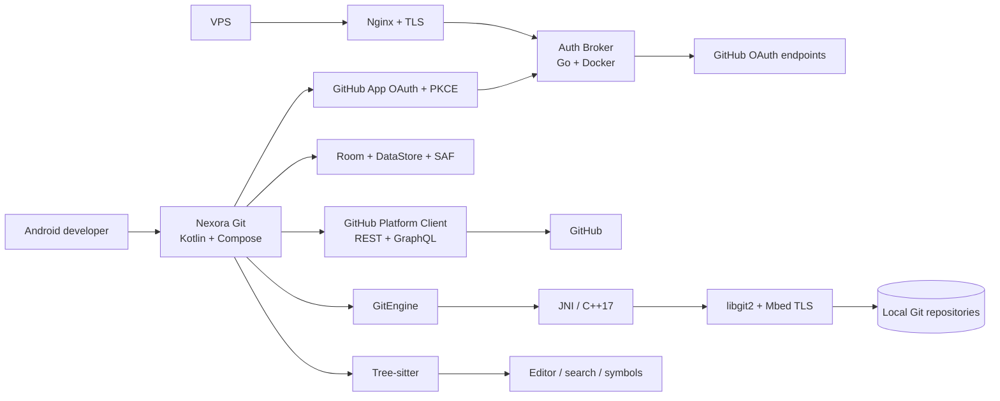

<div align="center">


# Nexora Git

**Advanced open-source Git and GitHub workspace for Android**

Build, edit, version, review, automate and release complete repositories directly from your phone — with a real local Git engine and native GitHub integrations.

[](https://github.com/Gh0stDeveloper/Nexora-Git/actions/workflows/android-ci.yml)
[](https://github.com/Gh0stDeveloper/Nexora-Git/actions/workflows/native-git-ci.yml)
[](https://github.com/Gh0stDeveloper/Nexora-Git/actions/workflows/codeql.yml)
[](LICENSE)


</div>

---

## Get Nexora Git

Official public builds are published through [GitHub Releases](https://github.com/Gh0stDeveloper/Nexora-Git/releases). Nexora Git does not treat random APK mirrors as trusted distribution.

Before installing a direct APK, verify both:

- the APK SHA-256 published with the release;
- the Android signing-certificate SHA-256 published by the official release pipeline.

Stable `v1.0.0` is intentionally blocked until the public beta/RC qualification matrix passes. See [Release process](docs/RELEASE_PROCESS.md) and [Security](SECURITY.md) for the trust model.

## Product screenshots

These images are generated from the real Jetpack Compose product surfaces by the repository's Android screenshot workflow. They are versioned with the UI so the README does not depend on hand-made mockups.

<table>
  <tr>
    <td align="center"><strong>Home · Dark</strong><br></td>
    <td align="center"><strong>Repository</strong><br></td>
    <td align="center"><strong>Editor</strong><br></td>
  </tr>
  <tr>
    <td align="center"><strong>Git workbench</strong><br></td>
    <td align="center"><strong>Pull Request</strong><br></td>
    <td align="center"><strong>GitHub Actions</strong><br></td>
  </tr>
</table>

### Theme variants

| Light | Dark | AMOLED |
| --- | --- | --- |
|  |  |  |

## Overview

Nexora Git is an Android-first development workspace for people who need a serious Git and GitHub workflow away from a desktop. It is **not a WebView wrapper** and it does not depend on Termux or an external Git installation.

The Android application combines a native Kotlin/Jetpack Compose interface, GitHub REST and GraphQL integrations, secure GitHub App authentication, Android project storage, an on-device editor and a real **libgit2** engine compiled through the Android NDK.

### What you can do

| Area | Capabilities |
| --- | --- |
| **Repositories** | Create, clone, import, browse, fork, star, watch and manage repository settings |
| **Local Git** | Status, stage, commit, branches, fetch, pull, push, merge, rebase, cherry-pick, stash, reset, revert, tags, submodules and Git LFS |
| **Code** | Browse files, history and blame; edit text/Markdown; search/replace; undo/redo; project-wide search |
| **Language intelligence** | Tree-sitter parsing, highlighting, symbols, diagnostics, formatting and a provider-neutral LSP architecture |
| **Collaboration** | Issues, comments, reactions, pull requests, reviews, checks and merge workflows |
| **Automation** | GitHub Actions workflows, runs, jobs, logs, reruns, cancellation and artifact downloads |
| **Releases** | Tags, release lifecycle, generated notes and release asset upload/download |
| **Account** | Multiple GitHub accounts, profile editing, organizations, stars, followers/following and activity |
| **Advanced GitHub** | Discussions, Projects V2, Pages, security feeds, Gists and Codespaces |
| **Offline workflow** | Local repositories, editing and Git operations continue without GitHub connectivity |

## System architecture



For detailed runtime, authentication, Git and VPS diagrams, see **[System Map](docs/SYSTEM_MAP.md)**.

## Technology stack

| Layer | Technology |
| --- | --- |
| Android | Kotlin 2.2.10, Jetpack Compose, Material 3, Navigation Compose |
| Architecture | Coroutines/Flow, Hilt, Room, DataStore |
| GitHub transport | Retrofit 3, OkHttp 5, GitHub REST + GraphQL |
| Local Git | libgit2 1.9.7, C++17, JNI, Android NDK 27.2 |
| TLS for native Git | Mbed TLS 3.6.7 LTS |
| Code intelligence | Tree-sitter runtime + bundled language grammars |
| Auth Broker | Go 1.24 |
| Deployment | Docker Compose, Nginx, Certbot / Let's Encrypt |
| CI / security | GitHub Actions, CodeQL, pinned third-party actions |

The complete versioned dependency inventory is in **[Dependencies](docs/DEPENDENCIES.md)**.

## Authentication and security

Nexora Git never asks users to type a GitHub password or passkey into the application. Authentication happens on GitHub's official authorization surface using a **GitHub App + OAuth Authorization Code + PKCE** flow.

The public APK does not contain the GitHub App client secret. A deliberately small Auth Broker performs confidential token exchange and refresh operations. On Android, access and refresh tokens are encrypted using an Android Keystore-backed AES-GCM key.

Security boundaries include:

- strict OAuth state and callback validation;
- PKCE for every authorization attempt;
- no secrets in Git remote URLs;
- GitHub token host isolation for native Git;
- cleartext traffic disabled in production;
- Android backups disabled for sensitive application data;
- release signing supplied externally;
- pinned native dependencies and CI actions;
- CodeQL and production security validation.

See **[Security](SECURITY.md)**, **[Threat Model](docs/THREAT_MODEL.md)** and **[Authentication](docs/AUTH.md)**.

## Build from source

### Requirements

- JDK 17
- Android SDK
- Android NDK `27.2.12479018`
- CMake `3.22.1`

The project pins its Gradle wrapper and Android/native dependency revisions.

```bash
git clone https://github.com/Gh0stDeveloper/Nexora-Git.git
cd Nexora-Git
./gradlew :app:assembleDebug
```

A functional GitHub login build also requires the public authentication configuration described in **[Authentication Deployment](docs/AUTH_DEPLOYMENT.md)**.

## Self-host the Auth Broker

Production deployments can use the included Debian/Ubuntu VPS installer. It preserves existing Nginx sites, installs only missing system dependencies, runs the broker in Docker on loopback, configures a dedicated Nginx virtual host and obtains/reuses a Let's Encrypt certificate.

```bash
curl -fsSL https://raw.githubusercontent.com/Gh0stDeveloper/Nexora-Git/main/scripts/vps/bootstrap.sh -o /tmp/nexora-git-bootstrap.sh
less /tmp/nexora-git-bootstrap.sh
sudo bash /tmp/nexora-git-bootstrap.sh
```

After installation, administration is performed through the `nexora-git` command. The same VPS also hosts the official GitHub-inspired **Nexora Git download website**, which publishes only verified signed APK releases.

See **[Download Website](docs/WEB.md)**, **[VPS Installer & Operations](docs/VPS_INSTALLER.md)**, the **[complete `nexora-git` command reference](docs/NEXORA_GIT_COMMANDS.md)** and **[Auth Broker](auth-broker/README.md)**.

## Documentation

Start with the **[Documentation Hub](docs/README.md)**.

Key references:

- [Architecture](docs/ARCHITECTURE.md)
- [Project specification](docs/PROJECT_SPEC.md)
- [Authentication](docs/AUTH.md)
- [Git engine](docs/GIT_ENGINE.md)
- [Android storage](docs/STORAGE.md)
- [Daily Git workflow](docs/DAILY_GIT_WORKFLOW.md)
- [Advanced Git](docs/ADVANCED_GIT.md)
- [GitHub platform layer](docs/PLATFORM_LAYER.md)
- [Release process](docs/RELEASE_PROCESS.md)
- [VPS installer](docs/VPS_INSTALLER.md)
- [Download website](docs/WEB.md)
- [`nexora-git` command reference](docs/NEXORA_GIT_COMMANDS.md)
- [Roadmap and implementation history](docs/ROADMAP.md)

## Community and contributing

Contributions are welcome when they preserve the project's security boundaries, native Git architecture and mobile-first goals.

- Read **[CONTRIBUTING.md](CONTRIBUTING.md)** before opening a pull request.
- Read **[SUPPORT.md](SUPPORT.md)** for usage help and bug-report guidance.
- Follow **[CODE_OF_CONDUCT.md](CODE_OF_CONDUCT.md)** in project spaces.
- Use the structured GitHub issue forms for reproducible bugs and focused feature requests.
- When GitHub Discussions is enabled, use it for questions, ideas and community support rather than bug tracking.
- For security issues, follow **[SECURITY.md](SECURITY.md)** and never publish secrets or working exploits in public issues or Discussions.

## License

Nexora Git is licensed under the **Apache License 2.0**. See [LICENSE](LICENSE) and [NOTICE](NOTICE).

---

<div align="center">

**Nexora Git — a complete Git workflow built for Android developers.**

</div>
