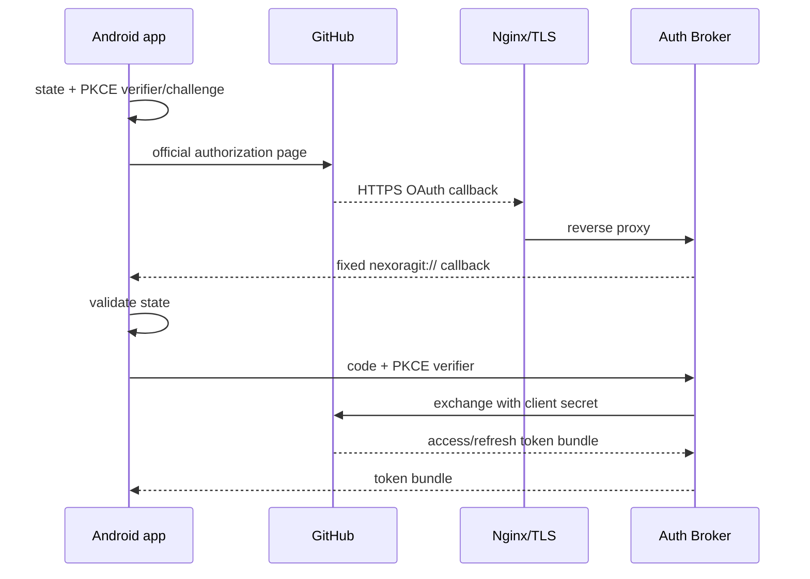

# Nexora Git Auth Broker

> [Project README](../README.md) · [Authentication](../docs/AUTH.md) · [Deployment runbook](../docs/AUTH_DEPLOYMENT.md) · [VPS installer](../docs/VPS_INSTALLER.md)

<p align="center">


</p>

The Auth Broker is a deliberately small confidential service used by Nexora Git's GitHub App OAuth flow. Its job is to keep the GitHub App `client_secret` out of the public Android APK.

It is **not a GitHub API proxy** and it does not store user repositories.

## Why the broker exists

A public Android application cannot safely protect a permanent GitHub App client secret. The Android client owns the PKCE verifier and OAuth state, while the broker adds the confidential application credential only when GitHub requires it for token exchange, refresh or revocation.



## HTTP API

| Method | Endpoint | Purpose |
| --- | --- | --- |
| `GET` | `/health` | health probe |
| `GET` | `/oauth/callback` | GitHub callback; forwards expected parameters to the fixed native URI |
| `POST` | `/v1/oauth/exchange` | exchange authorization code + PKCE verifier |
| `POST` | `/v1/oauth/refresh` | rotate an expiring GitHub token bundle |
| `POST` | `/v1/oauth/revoke` | revoke an individual user access token |

### Exchange request

```json
{
  "code": "authorization-code",
  "code_verifier": "pkce-verifier"
}
```

### Refresh request

```json
{
  "refresh_token": "ghr_..."
}
```

### Revoke request

```json
{
  "access_token": "ghu_..."
}
```

## Configuration

Copy the example environment file:

```bash
cp .env.example .env
```

Required values:

```env
GITHUB_APP_CLIENT_ID=Iv1....
GITHUB_APP_CLIENT_SECRET=...
GITHUB_CALLBACK_URL=https://auth.example.com/oauth/callback
APP_CALLBACK_URI=nexoragit://oauth/callback
PORT=8080
```

The GitHub App callback setting must exactly match `GITHUB_CALLBACK_URL`.

## Docker Compose

```bash
docker compose up -d --build
```

The repository Compose configuration binds the broker to loopback only:

```text
127.0.0.1:PORT
```

Use Nginx or another trusted TLS reverse proxy for public HTTPS termination.

For Debian/Ubuntu production hosts, prefer the managed [VPS installer](../docs/VPS_INSTALLER.md), which configures Docker, Nginx, Certbot, health checks and the `nexora-git` administration command.

## Security properties

- the client secret exists only in server configuration;
- OAuth callback destination is fixed server-side;
- request bodies are bounded and are not intentionally logged;
- PKCE verifier format is validated;
- refresh/revoke token formats are validated;
- sensitive responses use `Cache-Control: no-store`;
- per-IP rate limiting protects sensitive endpoints;
- the container runs non-root;
- the container filesystem is read-only;
- Linux capabilities are dropped;
- `no-new-privileges` is enabled;
- no general-purpose GitHub proxy endpoint exists.

## Local development

```bash
go test ./...
go vet ./...
go build ./...
```

Never commit a real `.env`, access token, refresh token or GitHub App client secret.

## CI

`Auth Broker CI` validates formatting, static analysis, tests and compilation:

```text
gofmt check
go vet ./...
go test ./...
go build ./...
```

## Production operations

The managed VPS deployment provides:

```bash
sudo nexora-git status
sudo nexora-git doctor
sudo nexora-git logs
sudo nexora-git update
sudo nexora-git restart
```

See [VPS Installer & Operations](../docs/VPS_INSTALLER.md) for the full lifecycle, TLS, rollback and shared-Nginx behavior.
