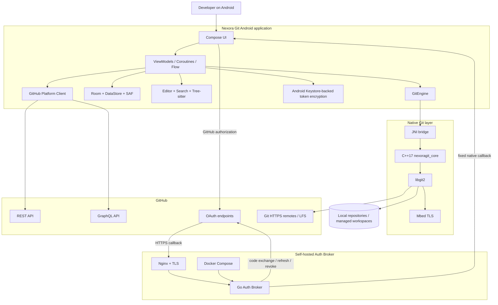
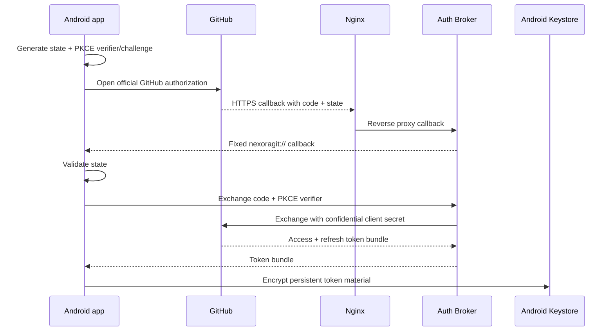
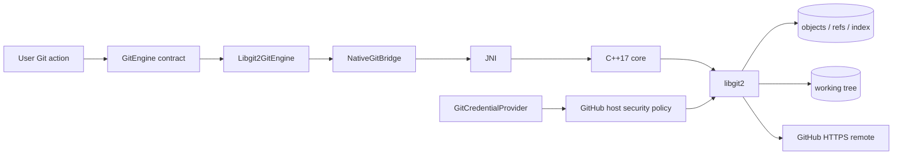
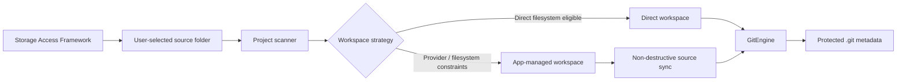

# System Map

> [Documentation hub](README.md) · [Architecture](ARCHITECTURE.md) · [Authentication](AUTH.md) · [VPS installer](VPS_INSTALLER.md)

This document is the visual map of Nexora Git. It shows the major runtime boundaries, data paths and deployment relationships without mixing them with implementation history.

## End-to-end runtime



## Authentication path



The broker never becomes a general GitHub API proxy. Normal GitHub API requests originate from the Android client using the authenticated user session.

## Local Git path



GitHub OAuth credentials are injected only at runtime and only for eligible `https://github.com` Git operations. Tokens are not persisted in remote URLs or `.git/config`.

## Android storage path



## VPS deployment map

```mermaid
flowchart TB
    INTERNET[Internet / GitHub callback]
    FIREWALL[Cloud firewall / security group]
    NGINX[Nginx shared reverse proxy]
    SITE1[Other VPS sites]
    VHOST[Nexora Git auth vhost]
    CERT[Let's Encrypt certificate]
    LOOP[127.0.0.1:18080-18180]
    BROKER[Auth Broker container]
    ENV[Root-readable .env]
    REPO[/opt/nexora-git]
    STATE[/etc/nexora-git-vps.conf]

    INTERNET --> FIREWALL --> NGINX
    NGINX --> SITE1
    NGINX --> VHOST
    CERT --> VHOST
    VHOST --> LOOP --> BROKER
    ENV --> BROKER
    REPO --> BROKER
    STATE --> REPO
```

Nginx can continue serving unrelated sites on the same VPS. The installer creates a dedicated `server_name` virtual host and exposes the broker only on loopback.

## Trust boundaries

| Boundary | Protected asset | Main controls |
| --- | --- | --- |
| GitHub ↔ Android | authorization response | PKCE, random state, strict callback parsing |
| Android ↔ Auth Broker | token exchange | HTTPS, fixed endpoints, bounded inputs |
| Android persistent storage | access/refresh tokens | Android Keystore-backed AES-GCM |
| Kotlin ↔ native Git | repository operations | typed contract, sanitized native errors |
| libgit2 ↔ remote | GitHub credential | HTTPS-only host policy, ephemeral credential callback |
| SAF source ↔ managed workspace | project data | canonical path checks, conflict detection, protected `.git` |
| Internet ↔ VPS broker | confidential OAuth service | Nginx TLS, loopback container port, rate limits, read-only container |
| CI ↔ release artifacts | signing/integrity | external secrets, pinned actions, signature verification, checksums |

---

[← Documentation hub](README.md)
