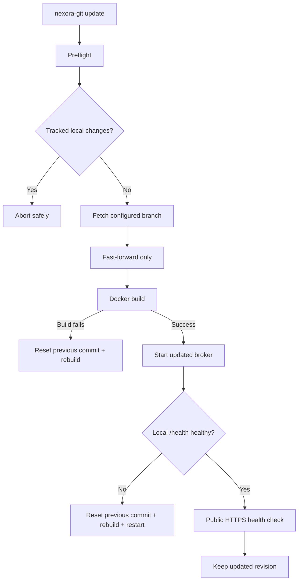

# Nexora Git VPS Installer & Operations

> [Documentation hub](README.md) · [Android Builder](VPS_ANDROID_BUILDER.md) · [Auth deployment](AUTH_DEPLOYMENT.md) · [Auth Broker](../auth-broker/README.md)

<p align="center">


</p>

The repository includes a managed production installer for the Nexora Git **Auth Broker** and the reusable **Android build-host foundation**. It is designed for Debian/Ubuntu VPS hosts that may already run other websites or services.

The installer is deliberately conservative:

- it installs only missing dependencies;
- it reuses an existing healthy Nginx installation;
- it preserves unrelated Nginx sites;
- it never terminates an unknown process to steal ports 80/443;
- it exposes the broker only on loopback;
- it keeps the GitHub App client secret out of Git;
- it validates local and public health before considering installation successful.

## Deployment architecture

```mermaid
flowchart LR
    INTERNET[Internet / GitHub] --> FW[Provider firewall]
    FW --> NG[Nginx :80 / :443]

    NG --> OTHER[Existing websites]
    NG --> VHOST[Nexora Git auth vhost]

    CERT[Let's Encrypt] --> VHOST
    VHOST --> LOOP[127.0.0.1:18080-18180]
    LOOP --> BROKER[Auth Broker container]

    ENV[/opt/nexora-git/auth-broker/.env] --> BROKER
    STATE[/etc/nexora-git-vps.conf] --> MANAGER[nexora-git manager]
    REPO[/opt/nexora-git] --> MANAGER
```

The local broker port is selected automatically from **18080–18180**. Docker publishes that port only on `127.0.0.1`; Nginx is the public TLS boundary.

## Requirements

| Requirement | Notes |
| --- | --- |
| OS | Debian or Ubuntu family |
| Privileges | root / `sudo` |
| Domain | FQDN pointed at the VPS |
| Network | inbound TCP 80 and 443 available to Nginx |
| GitHub App | Client ID and Client Secret |
| DNS | must resolve before Certbot can complete issuance |

Cloud-provider security groups/firewalls must allow TCP 80 and 443. The installer does not manage provider-level firewall policy.

## Recommended installation

Download and inspect the bootstrap script before executing it:

```bash
curl -fsSL https://raw.githubusercontent.com/Gh0stDeveloper/Nexora-Git/main/scripts/vps/bootstrap.sh -o /tmp/nexora-git-bootstrap.sh
less /tmp/nexora-git-bootstrap.sh
sudo bash /tmp/nexora-git-bootstrap.sh
```

Manual clone is also supported:

```bash
git clone https://github.com/Gh0stDeveloper/Nexora-Git.git
cd Nexora-Git
sudo bash scripts/vps/install.sh
```

The managed repository is stored at:

```text
/opt/nexora-git
```

### Installer inputs

The interactive installer asks for:

- Auth Broker domain;
- Let's Encrypt email;
- GitHub App Client ID;
- GitHub App Client Secret.

The expected GitHub App callback is:

```text
https://YOUR_DOMAIN/oauth/callback
```

## Installation lifecycle

The installer executes fourteen explicit stages:

| Stage | Action |
| ---: | --- |
| 1 | Clone/reuse the managed repository |
| 2 | Verify/install required system dependencies |
| 3 | Collect or reuse deployment configuration |
| 4 | Build and start the Auth Broker container |
| 5 | Create the dedicated Nginx virtual host |
| 6 | Obtain or reuse the Let's Encrypt certificate |
| 7 | Integrate firewall/management command safely |
| 8 | Provision/reuse the isolated Android build-host foundation |
| 9 | Create or verify/reuse the persistent Android Signing Vault |
| 10 | Install/enable the isolated Android background build worker |
| 11 | Verify persistent Android artifact/log lifecycle paths and policy |
| 12 | Validate GitHub release signing/parity foundation |
| 13 | Install autobuild/recovery operations and final hardening |
| 14 | Run final local/public health verification |

A failed prerequisite aborts rather than applying destructive workarounds.

## Dependency reuse

The installer checks before installing packages. Core dependencies include:

| Dependency | Why it is needed |
| --- | --- |
| Git | managed source/update flow |
| CA certificates + curl | secure downloads and health checks |
| Docker + Compose | Auth Broker runtime |
| Nginx | shared HTTP/TLS reverse proxy |
| Certbot + Nginx plugin | Let's Encrypt issuance/renewal |
| iproute2 / `ss` | port ownership diagnostics |
| OpenSSL | certificate diagnostics |
| OpenJDK 17 | pinned JVM toolchain for Android/Gradle builds |
| unzip | verified Android command-line tools extraction |
| util-linux / `flock` | single-worker build locking |

Existing dependencies are reused. Updating Nexora Git does **not** reinstall Nginx, Docker, Certbot or the operating-system packages.

## Shared VPS / Nginx coexistence

The installer owns only:

```text
/etc/nginx/sites-available/nexora-git-auth.conf
/etc/nginx/sites-enabled/nexora-git-auth.conf
```

Before enabling the site it checks whether another enabled Nginx configuration already owns the requested `server_name`. If there is a conflict, installation stops instead of overwriting another application.

If Nginx is not active and port 80 or 443 is already occupied, the installer prints the listener information and aborts. It does not kill the process automatically.

## TLS

Certbot obtains a Let's Encrypt certificate for the configured domain. Existing readable certificates for the same domain are reused.

The final vhost:

- redirects HTTP to HTTPS;
- supports TLS 1.2 and TLS 1.3;
- enables HSTS;
- disables TLS session tickets;
- adds `X-Content-Type-Options: nosniff`;
- adds `Referrer-Policy: no-referrer`;
- proxies only to the loopback broker port.

When the distro provides `certbot.timer`, the installer enables it.

## Secrets and state

### Confidential

```text
/opt/nexora-git/auth-broker/.env
```

The file is created with restrictive permissions and contains the GitHub App confidential configuration. It is ignored by Git.

### Non-secret deployment state

```text
/etc/nexora-git-vps.conf
```

This stores the managed install directory, domain, email, local port, repository URL and branch used by the manager/update scripts.

Never put the GitHub App Client Secret in the Android application, Gradle properties committed to Git, shell history, documentation examples or CI artifacts.

## Management command

The installer creates:

```text
/usr/local/bin/nexora-git
```

| Command | Purpose |
| --- | --- |
| `nexora-git status` | Show domain, port, branch, revision, Nginx/Docker/TLS and container state |
| `nexora-git update` | Fast-forward the configured branch, rebuild the broker and run health gates |
| `nexora-git doctor` | Run dependency, daemon, Nginx, broker, public HTTPS and certificate diagnostics |
| `nexora-git logs` | Follow Auth Broker container logs |
| `nexora-git start` | Start the broker service |
| `nexora-git stop` | Stop the broker service |
| `nexora-git restart` | Restart and verify local broker health |
| `nexora-git renew-cert` | Renew the configured certificate and reload Nginx |
| `nexora-git reconfigure` | Re-run the installer configuration path |
| `nexora-git config` | Show non-secret deployment configuration |
| `nexora-git version` | Print the installed Git commit |
| `nexora-git android status` | Show pinned Android host paths and component state |
| `nexora-git android doctor` | Validate JDK, SDK, Build Tools, NDK, CMake, Gradle wrapper and persistent paths |
| `nexora-git android setup` | Idempotently repair/reuse the Android build foundation |
| `nexora-git android config` | Show non-secret Android build-host configuration |
| `nexora-git android signing status` | Show public signing identity metadata without passwords |
| `nexora-git android signing verify` | Strictly validate keystore, credentials, fingerprints and integrity |
| `nexora-git android signing fingerprint` | Print public SHA-256/SHA-1 certificate fingerprints |
| `nexora-git android signing certificate` | Print the public release certificate in PEM form |
| `nexora-git android signing backup [PATH]` | Create an encrypted off-host-capable signing backup |
| `nexora-git android signing restore <PATH>` | Restore only when no conflicting signing identity exists |
| `nexora-git android build [release\|debug] [REF]` | Queue an immutable background build and return its job ID |
| `nexora-git android builds [LIMIT]` | List recent persistent build jobs |
| `nexora-git android job <JOB_ID>` | Show one build's mode, commit and state |
| `nexora-git android cancel <JOB_ID>` | Cancel a queued or running build |
| `nexora-git android worker status` | Show worker and queue state |
| `nexora-git android worker logs` | Follow the worker journal |
| `nexora-git android artifacts <JOB_ID>` | Show staged artifact files and metadata |
| `nexora-git android verify <JOB_ID>` | Strictly verify staged SHA-256 checksums |
| `nexora-git android log <JOB_ID> [LINES]` | Read the persistent per-build Gradle log |
| `nexora-git android retention status` | Show artifact/log retention policy and eligible count |
| `nexora-git android cleanup [--dry-run]` | Preview or apply conservative terminal-build pruning |
| `nexora-git android sign <JOB_ID>` | Sign a staged release outside the unprivileged build worker |
| `nexora-git android signed <JOB_ID>` | Verify/list signed APK/AAB outputs |
| `nexora-git android parity [JOB_ID]` | Verify current VPS material matches the last successful GitHub secret sync and optional signed build |
| `nexora-git github status` | Show public GitHub App/broker configuration without Client Secret |
| `nexora-git github configure` | Update Client ID/Client Secret while deriving URLs from the VPS domain |
| `nexora-git github secrets export [PATH]` | Create a protected seven-secret production bundle |
| `nexora-git github secrets apply` | Use authenticated GitHub CLI to synchronize the seven production environment secrets |
| `nexora-git github secrets status` | Show local sync parity record and GitHub secret names when available |
| `nexora-git android autobuild status` | Show update-triggered Android autobuild/debounce state |
| `nexora-git android autobuild enable [release\|debug] [SECONDS]` | Enable debounced build dispatch after successful VPS updates |
| `nexora-git android autobuild disable` | Disable update-triggered Android builds and clear the pending dispatch |
| `nexora-git recovery status` | Show operational checkpoint and encrypted signing-backup counts |
| `nexora-git recovery checkpoint [REASON]` | Capture a root-only checksummed operational checkpoint |
| `nexora-git recovery list [LIMIT]` | List recent checkpoints |
| `nexora-git recovery verify <ID>` | Verify checkpoint allow-list and SHA-256 integrity |
| `nexora-git recovery restore <ID>` | Restore configuration/code from a verified checkpoint and health-check it |
| `nexora-git help` | Show command usage |

`config` intentionally hides confidential values.

## Update and rollback flow



The updater never force-merges history. Tracked local changes cause an immediate abort so an update cannot silently overwrite manual modifications.

Before a real fast-forward the updater creates a root-only operational checkpoint. If the new broker build, local health gate or managed runtime refresh fails—or the update process is interrupted while the rollback guard is armed—the updater restores the previous Git revision and checkpoint, rebuilds the known-good broker and refreshes the prior runtime automatically.

Only one update runs at a time through a dedicated `flock` lock. If the remote commit is already installed, Docker rebuild and Android autobuild are skipped entirely.

After a healthy update, the configured autobuild dispatcher schedules the exact new commit. A 30-second default debounce and latest-pending-wins coalescing prevent rapid consecutive updates from creating a long queue of obsolete builds.

A failure of the **public** HTTPS health check after a successful local health check is treated as an infrastructure warning (for example DNS, Nginx or TLS), not as proof that the broker binary itself is broken.

## Health diagnostics

`nexora-git doctor` validates:

- `git`, `curl`, `docker`, `nginx`, `certbot`, `ss` and `openssl`;
- Docker daemon health;
- Nginx configuration syntax;
- local broker `/health`;
- public HTTPS `/health`;
- certificate existence and seven-day expiry safety window;
- Docker Compose service state.

## Firewall behavior

The installer **never enables UFW**.

If UFW is already active, it allows the standard `Nginx Full` profile. Otherwise firewall policy is left unchanged.

## Reconfiguration

Use:

```bash
sudo nexora-git reconfigure
```

Reconfiguration preserves the same safety rules: no unrelated Nginx site is overwritten and the confidential broker environment remains separate from deployment state.

## Troubleshooting checklist

1. Run `sudo nexora-git doctor`.
2. Confirm DNS resolves to the VPS.
3. Verify cloud firewall/security-group rules permit 80/443.
4. Run `sudo nginx -t`.
5. Inspect `sudo nexora-git status`.
6. Inspect `sudo nexora-git logs`.
7. Confirm the GitHub App callback exactly matches `https://DOMAIN/oauth/callback`.
8. Confirm the broker `.env` remains readable only by the intended privileged context.

## Files owned by the deployment

| Path | Responsibility |
| --- | --- |
| `/opt/nexora-git` | managed repository |
| `/opt/nexora-git/auth-broker/.env` | confidential broker environment |
| `/etc/nexora-git-vps.conf` | non-secret installer state |
| `/etc/nginx/sites-available/nexora-git-auth.conf` | Nexora Git Nginx vhost |
| `/etc/nginx/sites-enabled/nexora-git-auth.conf` | enabled vhost symlink |
| `/usr/local/bin/nexora-git` | management command symlink |
| `/etc/nexora-git/android-builder.conf` | non-secret pinned Android toolchain configuration |
| `/opt/nexora-android-sdk` | persistent Android SDK/NDK/CMake toolchain |
| `/var/cache/nexora-git/gradle` | persistent Gradle cache owned by the isolated builder user |
| `/var/lib/nexora-git/android` | persistent Android queue/build state |
| `/var/lib/nexora-git/android/artifacts` | atomic staged APK/AAB/symbol artifacts with manifests/checksums |
| `/var/lib/nexora-git/android/logs` | persistent per-build Gradle logs |
| `/var/lib/nexora-git/signing` | root-only Android release Signing Vault and encrypted backups |
| `/var/lib/nexora-git/operations` | root-only update locks, pending autobuild dispatch and checksummed recovery checkpoints |
| `/etc/nexora-git/android-autobuild.conf` | non-secret autobuild mode/debounce configuration |
| `/etc/systemd/system/nexora-git-android-autobuild.service` | root dispatcher that queues snapshots without exposing signing material |
| `/etc/systemd/system/nexora-git-android-autobuild.timer` | persistent debounce dispatcher timer |
| `/etc/systemd/system/nexora-git-android-worker.service` | hardened detached Android build worker |
| `/usr/local/libexec/nexora-git-android-worker` | stable worker executable symlink |
| `/etc/letsencrypt/live/DOMAIN/` | TLS material managed by Certbot |

---

[← Documentation hub](README.md)
